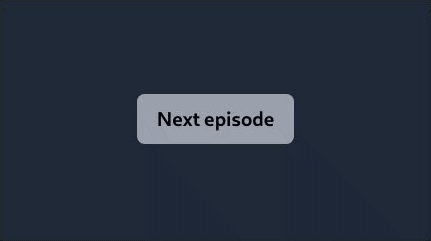

# Netflix next episode button made with XState, CSS Transition and Svelte

The action will be automatically executed after a delay. If the user move the mouse, we enter the manual mode. Then, the user needs to click the button to execute the action.

